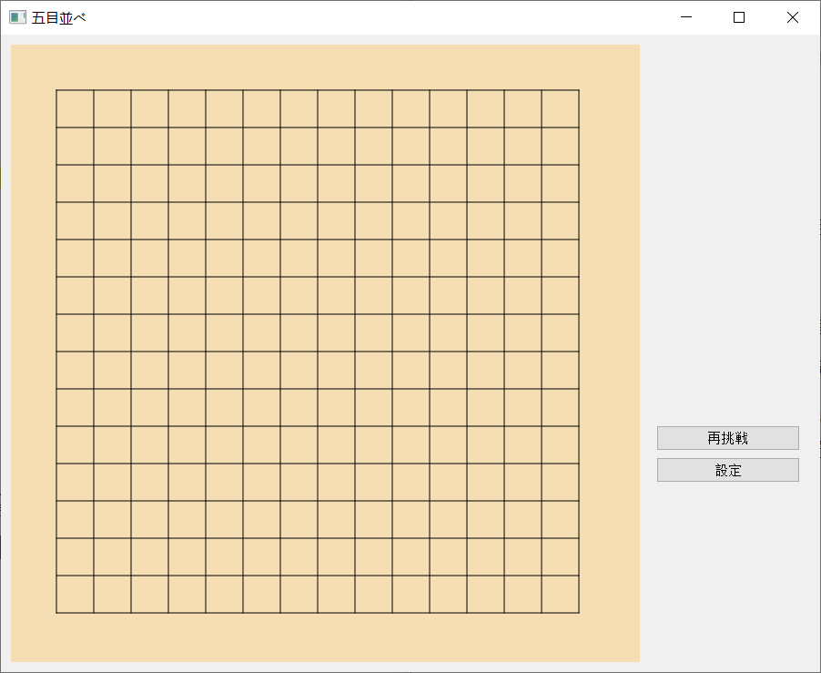
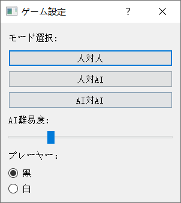
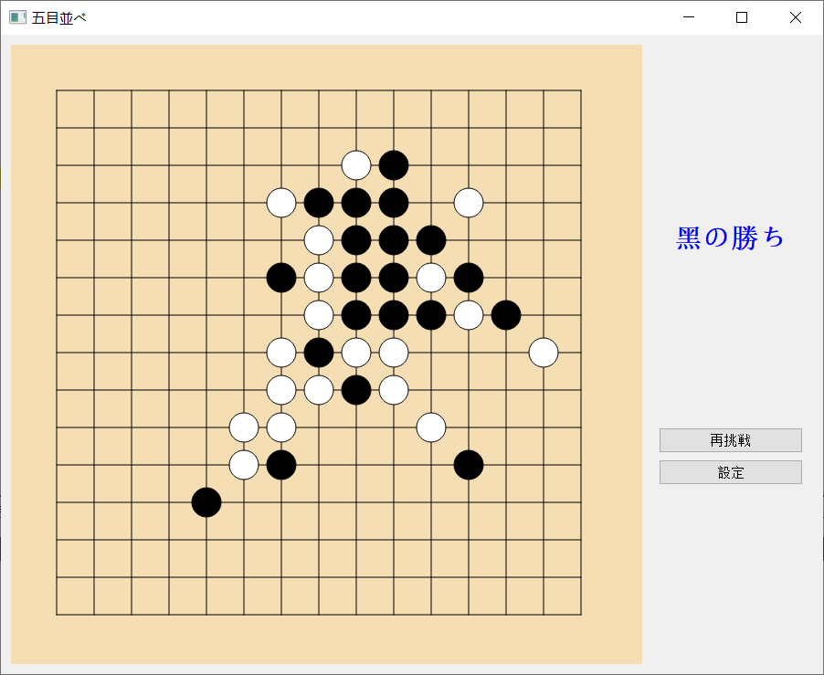

# 五目並べ（Gomoku）プロジェクト

## 概要
本プロジェクトは **Qt/C++** で実装された **五目並べ** ゲームです。  
プレイモードは以下の3種類があります：  
- 人対人  
- 人対AI  
- AI対AI  

AIはシンプルな **Negamax探索** と評価関数で最適手を選択します。  
相手の四連を防ぐロジックも含まれています。  
UIでは盤面、駒、ゲーム状態を表示し、インタラクティブにプレイ可能です。

---

## ファイル構成

Gomoku/
│
├─ main.cpp                 // アプリケーション起動ポイント  
├─ Gobang.pro               // Qt プロジェクトファイル  
├─ mainwindow.h             // MainWindow クラス、ゲームフロー、AI操作、UI制御  
├─ boardwidget.h            // BoardWidget クラス、盤面描画、クリック処理  
├─ gomoku.h                 // Gomoku クラス、盤面管理、手の処理、勝利判定、AI評価  
├─ settingsdialog.h         // SettingsDialog クラス、ゲームモード、AI深さ、プレイヤー色選択  
└─ resources.qrc            // Qtリソース（アイコンや画像など、必要に応じて）

---

## 機能
- クリック可能なインタラクティブな盤面  
- ゲーム状態や勝敗の表示  
- AIの深さやプレイヤー色を設定可能  
- AIは勝利手や相手の四連阻止を優先  
- AI対AIプレイでは可視化のためのディレイ付きで自動進行

## 実例
- 初期画面 / 初始化界面 / Initial Page

- 設定画面 / 设置界面 / Setting Page 

- 人（白）対AI / 人（执白）机对局 / Human (White) vs. AI 
 vs. AI")
- 人（黒）対AI / 人（执黑）机对局 / Human (Black) vs. AI 
 vs. AI")
- 人対人 / 人人对局 / Human vs. Human 

# Gomoku (Five-in-a-Row) Project

## Overview
This project implements a **Gomoku (Five-in-a-Row)** game in **Qt/C++** with three modes:  
- Human vs Human  
- Human vs AI  
- AI vs AI  

The AI uses a simple **Negamax search** with evaluation to choose moves, including blocking opponent's potential four-in-a-row. The UI shows the board, pieces, and game status, and allows interactive play and settings adjustment.

---

## File Structure

Gomoku/
│
├─ main.cpp                 // Entry point, launches the application  
├─ Gobang.pro               // Qt project file  
├─ mainwindow.h             // MainWindow class, handles game flow, AI moves, and UI  
├─ boardwidget.h            // BoardWidget class, draws the board and pieces, handles clicks  
├─ gomoku.h                 // Gomoku class, manages board state, moves, win detection, AI evaluation  
└─  settingsdialog.h         // SettingsDialog class, selects game mode, AI depth, and player color  

---

## Functionality
- Interactive board with clickable cells  
- Displays game status and results  
- Configurable AI depth and player color  
- AI prioritizes winning moves and blocking opponent's four-in-a-row  
- Supports automatic AI vs AI play with delays for visualization

# 五子棋（Gomoku）项目

## 概述
本项目是使用 **Qt/C++** 实现的 **五子棋** 游戏。  
游戏模式有三种：  
- 人对人  
- 人对AI  
- AI对AI  

AI 使用简单的 **Negamax搜索** 和评估函数选择最佳落子。  
包括阻止对手形成四连的策略。  
UI 显示棋盘、棋子和游戏状态，支持交互式游戏。

---

## 文件架构

Gobang/
│
├─ main.cpp                 // 程序入口，启动应用  
├─ Gobang.pro               // Qt 项目文件  
├─ mainwindow.h             // MainWindow 类，处理游戏流程、AI落子和界面  
├─ boardwidget.h            // BoardWidget 类，绘制棋盘和棋子，处理点击事件  
├─ gomoku.h                 // Gomoku 类，管理棋盘状态、落子、胜负判定、AI评估  
└─ settingsdialog.h         // SettingsDialog 类，选择游戏模式、AI深度和玩家颜色  

---

## 功能
- 可点击的交互式棋盘  
- 显示游戏状态和胜负结果  
- 可配置 AI 深度和玩家颜色  
- AI 优先考虑获胜落子及阻止对方四连  
- 支持 AI 对 AI 自动下棋，带落子延时便于观察

